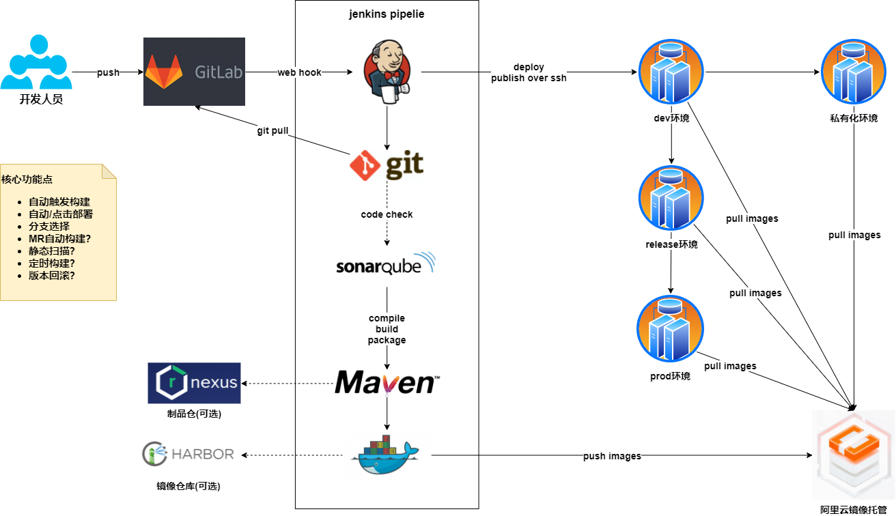

## 基于jenkins的持续集成方案

#### 1.整体流程

#### 2.devops工具集整理

- 自动化流水线

**jenkins**

- 构建工具

**maven**

- 二进制仓

[**JFrog**](https://blog.csdn.net/afandaafandaafanda/article/details/81735013)

**Nexus**

- 镜像仓库

**harbor**